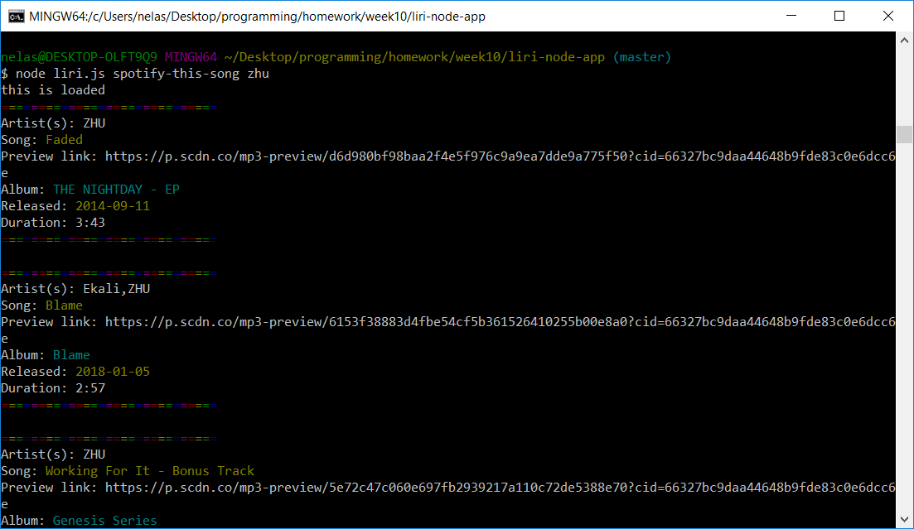
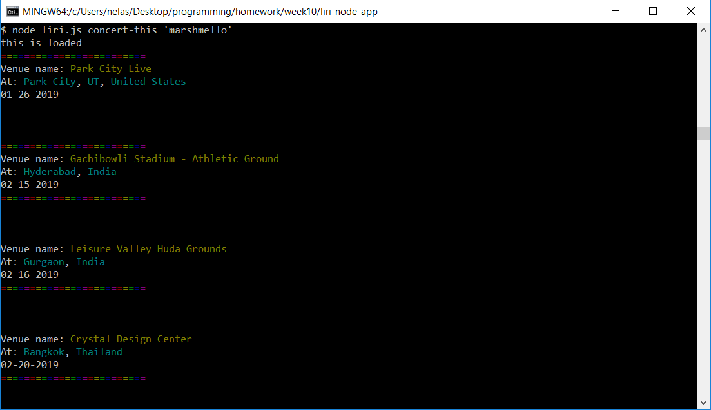
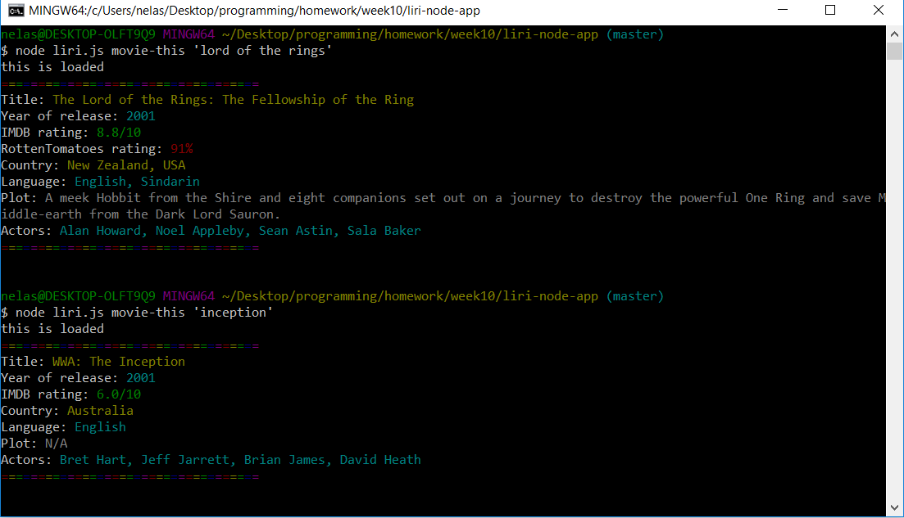
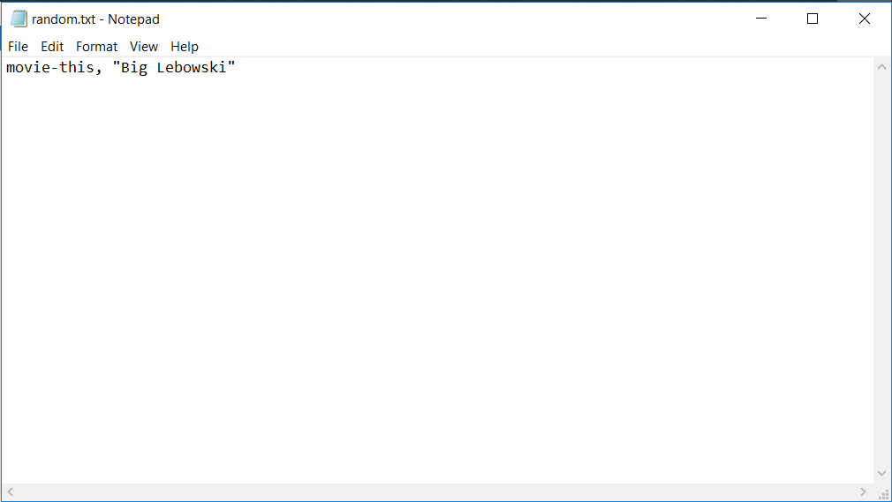
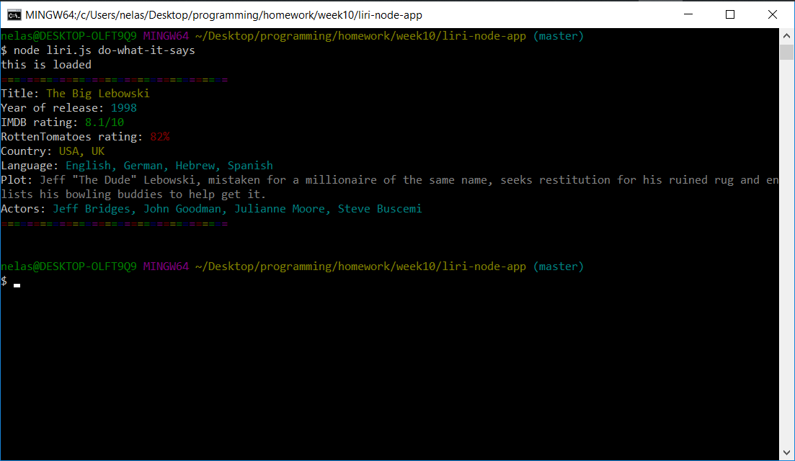
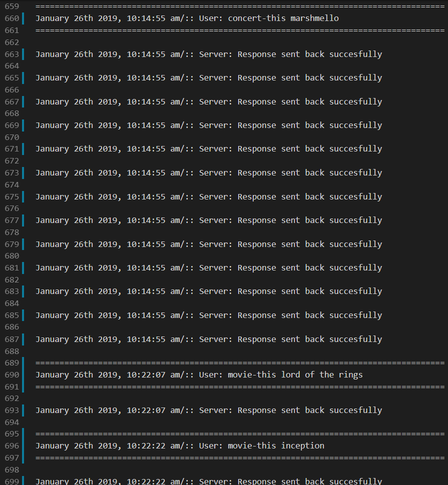
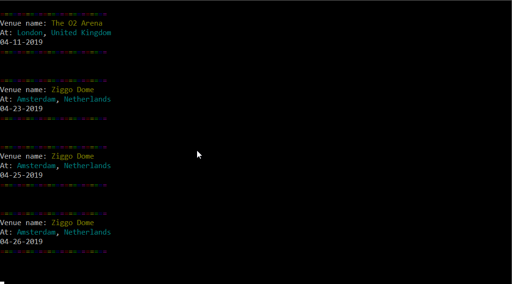
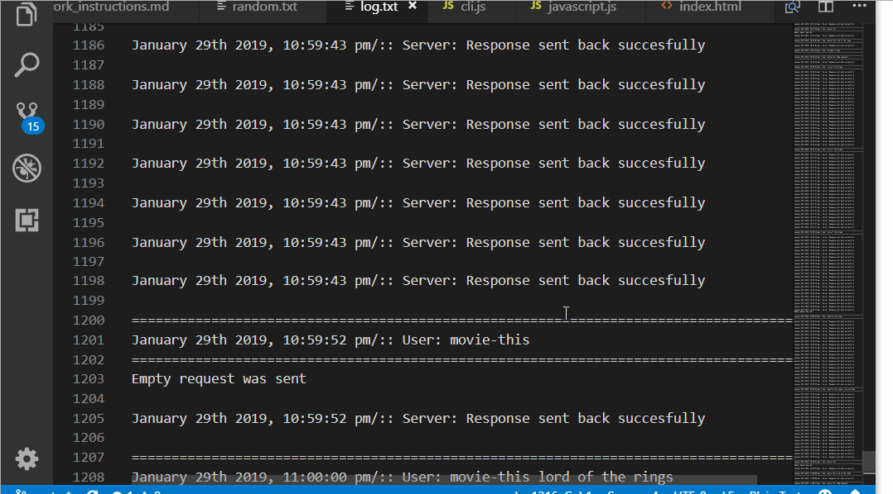

# LIRI-node-app
### LIRI is like iPhone's SIRI. However, while SIRI is a Speech Interpretation and Recognition Interface, LIRI is a _Language_ Interpretation and Recognition Interface. LIRI will be a command line node app that takes in parameters and gives you back data.
#### _Note: LIRI requests must follow the format: node liri.js (command) (request). Please enclose the request in quotation marks ""_ if it contains more than one word

* **Spotify Song Information:**  
Using the command "spotify-this-song", users will access Artist, Title, Release date, Duration time and Album Title information; along with a URL to a song preview if available for 20 songs matching users query.

* **Bands in town Concert Information:**  
Using the command "concert-this", users will access information on upcoming concerts for a specified band. LIRI will display the Venue Name, Location of Venue, and Date of concert for requested musician or musical band.

* **OMDB Movie Information:**  
Using the command "movie-this", users will access information on a requested movie. LIRI will display: Title, Year, IMDB Rating, Rotten Tomatoes Rating, Country Produced, Language, Plot, and Main Cast of requested movie

* **Random.txt execution**  
Using the command "do-what-it-says", LIRI will access one of her other commands, as chosen by the random.txt file.  
_Note: No requset is required for the Random command_

_Note: Program handles all types of known errors, including empty response, missing JSON values and empty user request input_

_Note: All user and server activity is logged in log.txt file_

Application in use

